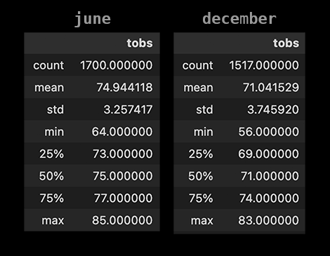
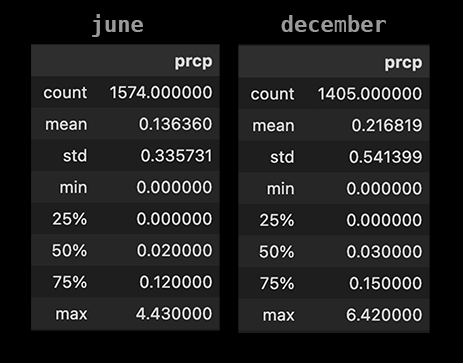
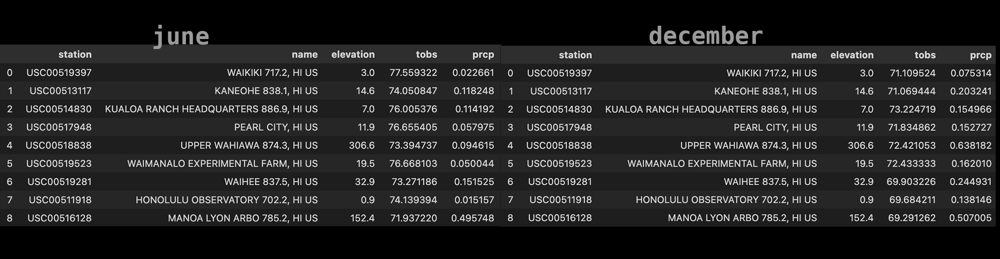

# surfs_up

# Purpose 

The purpose of this analysis is to examine weather data for the months of June and December in Oahu, in order to determine if the surf and ice cream shop business is sustainable year-round. We will look initially at temperature data for the months of June and December, then percipitation levels for the same months as well as average measurements for both based on the weather station that provided the data which was recorded during a 7 year period between 2010 and 2017. 

# Results

- Minimum temperatures are 8 degrees lower in December compared to June.
- Maximum temperatures are 2 degress higher in June compared to December. 
- Average temperatures are 3 degrees higher in June at 75 degrees compared to 71 in December. 
- Standard deviation is 3.25 for June and 3.75 for December. 

# Summary

## Proof of a steady temperature pattern
The most important result of our analysis is the standard deviation of daily temperature range. The values for both months indicate remarkably steady temperature patterns. The mean Standard Deviation for June is well below the **mean std for summer days** which stands at 3.717 - In our case **std** for June is 3.25. Similarly std for June is also a bit lower than the **mean std for winter days** which stands at 3.807 - In our case **std** for December is 3.75. 

Zooming in into the numbers we see that the variation in temperatures is rather mild. With a year-round low of around 55 degrees, highs around 85 and means slightly over 71 degrees the surf and ice-cream business is fail safe. December is of course a colder month but with a standard deviation at 3.25 and 3.75, one might cocnlude there is mimimal temporal variability in recorded temperatures. A surf business could definitely operate year round based on the temperature. 

Let's examine though another significant variable which is rainfall. 

## Precipitation stats

Looking at precipitation averages we see double amounts of rainfall in December compared to June. What is also almost double in December is standard deviation at 0.54 compared to 0.34 in June. These values indicate very high and high temporal variability of rainfall respectively, similar to the one of the Mediterranean climate. Especially for December rainfall will vary +/- 54% from its long term average. 

Lastly let's take a look at the specifics of Stations recording our data. 

## Station specifics

Looking at the Stations data we may locate favorable locations to set up shop. For example, we see that Waikiki station recorded both the highest average temperatures in December and the lowest precipitation amounts for the same period of time.

On the opposite side, we see Manoa Lyon Arbo which scores both the lowest average temperatures and highest precipitation amount for both June and December. Surely an area to avoid. 
